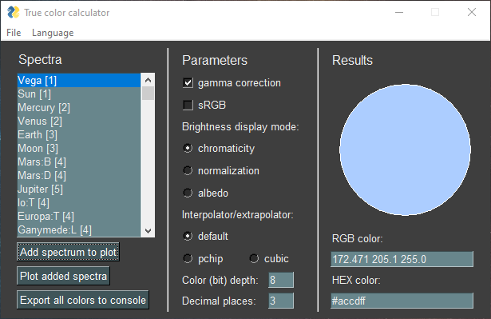

# True Color Tools
A set of Python scripts for calculating human-visible colors of celestial bodies from their spectra or color indices.

### Tools:
- [`true-color-calc.py`](Scripts/true-color-calc.py) calculates colors of one or several objects and build their spectra;
- [`true-color-calc_GUI.py`](Scripts/true-color-calc_GUI.py) calculates colors much more conveniently with a graphical interface and visualization;
- [`true-color-table.py`](Scripts/true-color-table.py) generates a customizable table of the celestial bodies' colors.

### Auxiliary:
- [`user.py`](Scripts/user.py) returns the specified language and path to the tools, or determines them automatically;
- [`config.py`](Scripts/config.py) allows you to specify in it the language and path applicable to all tools;
- [`convert.py`](Scripts/convert.py) contains everything that is directly related to calculations (functions, zero points of photometric systems, used curves of color space and sensitivity of human perception);
- [`spectra.py`](Scripts/spectra.py) is a database of spectra, color indices and their sources;
- [`translator.py`](Scripts/translator.py) contains almost all used inscriptions of other scripts in supported languages.

## Installation
Press the button `Code`, then I recommend choosing `Download ZIP`. After downloading, unpack the archive. You can also clone the repository.

The tool requires Python 3.6 or higher (due to f-strings) and probably Windows (due to system calls in [`user.py`](Scripts/user.py)). No internet connection is required for all scripts to work.

Also, you need [NumPy](https://numpy.org/), [SciPy](https://www.scipy.org/), [Pillow](https://pillow.readthedocs.io/), [Plotly](https://plotly.com/python/) and [PySimpleGUI](https://pysimplegui.readthedocs.io/). If you use Anaconda, the first 4 libraries are already preinstalled. You can (wasn't checked) install the libraries all at once using [`requirements.txt`](requirements.txt):
```
python -m pip install -r requirements.txt
```

## Using tools
You probably want to use `true-color-calc_GUI.py` as the other two tools require understanding the code. This is what the interface looks like:


On the left is a list of all available spectra in the database. The number of the source is indicated in square brackets, a list of which can be found in `File` → `Sources`. Also, after the an object's name there can be abbreviations, the decoding of which is indicated in `File` → `Notes`.

You can get colors formatted for Celestia. It uses chromaticity values from 0 to 1 for each color channel, where 1 is the value of the brightest channel. In the GUI version, you need to make sure that the `chromaticity` mode is used and `Decimal places` is greater than zero (by default it is), and then set the `Color (bit) depth` parameter to zero.

You can add spectra in the database. It's the `objects` dictionary in [`spectra.py`](Scripts/spectra.py). The spectrum can be set in many ways, below is a list of the parameters used.

```py
Mandatory parameters:
"nm" # list of wavelengths in nm
"br" # same-size list of reflectivity
"mag" # same-size list of magnitudes
"filters" # filter system, one from convert.py → filters
"indices" # dictionary of color indices, use only with "filters"; min wavelength color index → max wavelength color index
"bands" # list of filters' names, use only with "filters" 

Optional parameters:
"albedo" # bool (True if reflectivity was set by albedo values) or float (in V band or on 550 nm)
"sun" # bool (True if spectrum contains the solar reflection)
"obl" # oblateness (float, from 0 to 1)
"tags" # not used for now
```

## Localization
Language detection priority order:
1) Manual language indication on the top of a tool's code;
2) Using the language specified in the [`config.py`](Scripts/config.py);
3) Automatic system language detection.

```py
lang = user.lang() # config.py or system language

lang = user.lang("ru") # the same as user.lang("Russian") and user.lang("Русский")
```

The tools support English and Russian. German is a stub in the file for storing titles in different languages, [`translator.py`](Scripts/translator.py). If someone wants to add support for any language, this can be done simply.