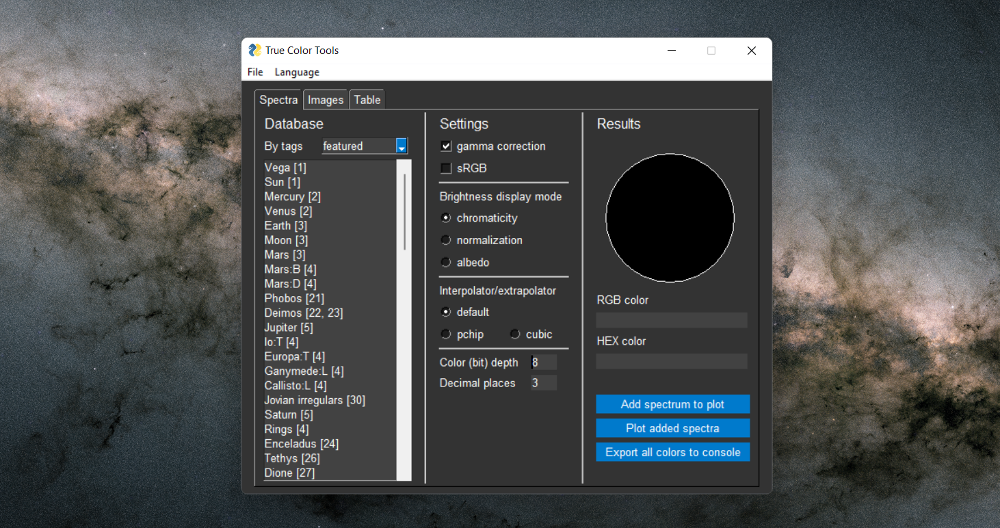

# True Color Tools
Astronomy-focused set of Python tools with GUI that use spectra construction and eye absorption to calculate realistic colors.

Input data is accepted in the form of channel measurements, color indices, magnitudes and even images.
Customizable output in RGB, Hex, image or spectra database table.

### Tools in [`TCT.py`](Scripts/TCT.py):
- `Spectra` tab provides access to the built-in spectra database and allows you to calculate a color with the selected settings just by clicking on an object;
- `Images` tab allows you to load images, specify their wavelength and display a true color image, for each pixel of which a spectrum was built;
- `Table` tab generates a customizable table of calculated colors from the spectra database.

### Auxiliary:
- [`user.py`](Scripts/user.py) returns the specified language and path to the tools, or determines them automatically;
- [`config.py`](Scripts/config.py) allows you to specify in it the language and path applicable to all tools;
- [`calculations.py`](Scripts/calculations.py) is the mathematical core. It contains most of functions and some zero points of photometric systems;
- [`cmf.py`](Scripts/cmf.py) contains sensitivity of human perception and used curve of color space;
- [`database.py`](Scripts/database.py) contains spectra, color indices and their sources;
- [`strings.py`](Scripts/strings.py) contains almost all used inscriptions of other scripts in supported languages.

## Installation
For the GitHub web interface: press the button `Code`, then I recommend choosing `Download ZIP`. After downloading, unpack the archive. You can also clone the repository.

The tool requires Python 3.6 or higher (due to f-strings) and probably Windows (due to system calls in [`user.py`](Scripts/user.py)). No internet connection is required for all scripts to work.

Also, you need [NumPy](https://numpy.org/), [SciPy](https://www.scipy.org/), [Pillow](https://pillow.readthedocs.io/), [Plotly](https://plotly.com/python/) and [PySimpleGUI](https://pysimplegui.readthedocs.io/). If you use Anaconda, the first 4 libraries are already preinstalled. You can (wasn't checked) install the libraries all at once using [`requirements.txt`](requirements.txt):
```
python -m pip install -r requirements.txt
```

## How to use

[TCT.py](Scripts/TCT.py) includes three tabs for different purposes: *Spectra*, *Images* and *Table*. The first and last tabs are linked to the database, the *Images* tab asks for input.



Several global concepts:
- The wavelengths are always increasing. This is important for customizing the database and for numbering images.
- Database of spectra. Its format is just a dictionary in a Python file and is practically json. You can modify it with your own spectra, and, if you want, share data for TCT.
- Tag system. Each object in the database can be assigned an arbitrary set of tags. Same tags form a lists in the *Spectra* and *Table* tabs, which simplify interaction with a huge database.
- System of sources. Each object in the database can be easily linked to one or several sources by its number. You can see the list in `File`→`Sources`. Also, after an object's name there can be abbreviations, the decoding of which is indicated in `File`→`Notes`.


In the *Images* tab you can get colors formatted for Celestia. It uses chromaticity values from 0 to 1 for each color channel, where 1 is the value of the brightest channel. In the GUI version, you need to make sure that the `chromaticity` mode is used and `Decimal places` is greater than zero (by default it is), and then set the `Color (bit) depth` parameter to zero.

## Database format

### Mandatory parameters
- `nm`: list of wavelengths in nm
- `br`: same-size list of reflectivity
- `mag`: same-size list of magnitudes
- `filters`: filter system, one from convert.py → filters
- `indices`: dictionary of color indices, use only with `filters`
- `bands`: list of filters' names, use only with `filters` and `i/f` instead of `br`

### Optional parameters
- `albedo`: bool (`True` if reflectivity was set by albedo values) or float (in V band or on 550 nm)
- `sun`: bool (`True` if spectrum contains the solar reflection)
- `obl`: oblateness for the `Table` tab (float, from 0 to 1)
- `tags`: list of strings, categorizes a spectrum

## Localization
Language detection priority order:
1) Manual language indication on the top of a tool's code;
2) Using the language specified in the [`config.py`](Scripts/config.py);
3) Automatic system language detection.

```py
lang = user.lang() # config.py or system language

lang = user.lang("ru") # the same as user.lang("Russian") and user.lang("Русский")
```

The tools support English and Russian. German is a stub in the file for storing titles in different languages, [`strings.py`](Scripts/strings.py). If someone wants to add support for any language, this can be easily done.