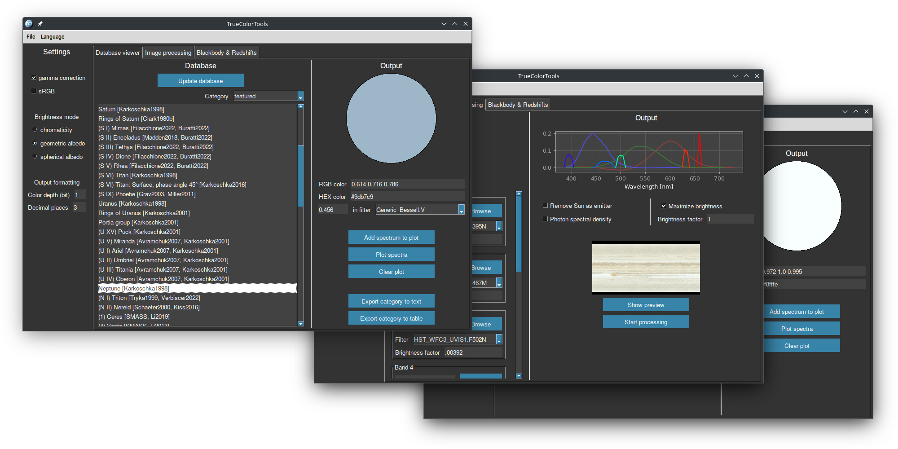

Astronomy-focused set of Python tools with a GUI that uses spectrum construction and eye absorption to compute realistic colors.

Input data is accepted in the form of filters measurements (such as color indices) or continuous spectra, in flux units or in magnitudes. Stores a comprehensive catalog of photometry in a proprietary format. Can process spectral cubes, multiband spacecraft images and correct images in enhanced colors.

Please note that this is a hobby project and no guarantees are provided for the results. Help is welcome!

## Installation

TrueColorTools has been tested on Windows 10/11, macOS and Linux. It requires Python 3.10 or higher, which does not have support for Windows 7. [This](https://github.com/adang1345/PythonWin7) startup tool can be used in this case. Depending on the system, you may need to clarify the executing program by replacing `python` with `python3` in the instructions below. Versions of libraries listed in [requirements.txt](requirements.txt) are frozen as of April 2024.

**Step Zero**: Clone the repository or download the archive using the GitHub web interface. In the console, go to the project root folder.

### Simple installation
1. Install the dependencies with `pip install -r requirements.txt`;
2. Execute `python -u runTCT.py`.

### In virtual environment
1. Create a virtual environment with `python -m venv .venv`;
2. Install the dependencies with `.venv/bin/pip install -r requirements.txt`;
3. Execute `.venv/bin/python -u runTCT.py`.

### Executable file
[SevenSpheres](https://github.com/SevenSpheres) compiles stable versions of TrueColorTools for Windows 8/10/11. Thus, Python is not required in this installation way.
1. Go to [releases of SevenSpheres' fork](https://github.com/SevenSpheres/TrueColorTools/releases);
2. Select, download and unpack the desired archive from the assets;
3. Run `TCT.exe`.

## How it works?

The key processing method is to convert a photometric data into a continuous spectrum and convolve it with color matching functions of an eye. Summary of the standard steps:

1. Data reading and conversion into the form of "wavelength: spectral energy density". Built-in filter information is used to work with color indices and spacecraft images.
2. The resulting values are interpolated (and extrapolated if necessary). The program uses its own functions, which are faster and more reliable than SciPy's. The plan is to replace the interpolation with an algorithm that takes into account the profile of the filters.
3. By default, the spectrum is convolved with RGB sensitivity curves. When sRGB mode is enabled, the spectrum is first convolved into XYZ space and then RGB is calculated with assuming of the illuminant E (the equal energy white point is much better than standard D65 for our purposes).

## How to use?
GUI is the only way to interact with TrueColorTools. If you run it from the command line, you can set the startup language <!--- and CLI verbosity level--> (run with `--help` for details). No Internet connection is required, the databases are stored in the appropriate repository folders, and you can replenish them.

Program interface is functionally divided into tabs: *Database viewer*, *Image processing* and *Blackbody & Redshifts*. Color output formatting, often common to tabs, is located in the sidebar settings.

The **Database viewer** tab provides access to the spectra database and allows you to calculate a color with the selected settings by simply clicking on an object. It is possible to plot one or more spectra from the database in a pop-up window. You can process the colors of an entire category at once and get the output in text form or as a graphical table ([examples](tables/)).

The **Image processing** tab accepts regular images, a series of black and white images, or a spectral cube as input. Using the wavelength information, the image is restored in true color. The internal operations are similar to reconstructing the spectrum for each pixel.

The **Blackbody & Redshifts** tab calculates the influence of physical phenomena on color. Based on the blackbody spectrum, the program displays the color and brightness changes due to Doppler and gravitational redshifts. You can lock the exposure on the logarithmic scale of apparent magnitude, setting the overexposure limit for a tuned blackbody object if it was in the sky replacing the Sun (at the same angular size).

### Features
- Tag system: Any spectrum in the database can be assigned any set of tags. They form lists of categories for the *Database viewer* tab, which makes working with the database easier.
- Reference system: Each object in the database can be easily linked to one or more data sources by its short name. You can see the list in `File`→`References`.
- Multilingual support: The language can be changed from the top menu at runtime. TCT supports English, German and Russian. If you want to add support for your language, you can do it similar to [`strings.py`](src/strings.py) and make a commit or contact me.

## Databases

### Spectra database structure
Data listed in JSON5 files can be of two types: reference and photometric. There are no restrictions on their order and relative position at all (data block and its reference block can be in different files), but it is usually convenient to list the sources at the beginning of the file, then the spectra.

The brightness scale is not strictly tied to physical quantities. Using the `albedo` key, you can indicate that the appropriate spectrum is scaled and the brightness in the range 0 to 1 should be treated as reflectance. The scaling task can be left to the program by specifying a wavelength or filter for which the albedo is known. Optional internal standard is flux spectral density measured in W / (m² nm).

For the visible range, there are two main types of albedo: geometric and spherical. Geometric albedo is coefficient of reflected light at the zero phase angle (for simplicity, normal albedo is now not distinguished from geometric albedo). It is usually brighter than the spherical albedo, the ratio of all incident light to all reflected light. If one is not specified in the database or can't be calculated from the phase function, TCT uses a theoretical model to convert one to the other for the appropriate brightness display mode. If no albedo is specified, the object will not be displayed in albedo modes (exception for the `star` tag). The `albedo` parameter indicates both albedos at once, but it is not recommended.

Phase functions are now used to calculate the phase integral, which is used to convert between spherical and geometric albedo. The name and function parameters are stored in the database as `['name', {param1: value1, ...}]`, each value can be numeric or a list of `[value, sd]`. The following phase functions are supported:
- `HG`: requires `G` parameter, see [Bowell et al. 1989](https://ui.adsabs.harvard.edu/abs/1989aste.conf..524B/abstract).
- `HG1G2`: requires `G_1` and `G_2`, see [Muinonen et al. 2010](https://ui.adsabs.harvard.edu/abs/2010Icar..209..542M/abstract).

It is assumed that all data is given in ascending wavelength order, and it is necessary to specify "white spectrum" for calibration if the photometric system does not determine it by equal-energy flux density by wavelengths ([this link](https://hst-docs.stsci.edu/acsdhb/chapter-5-acs-data-analysis/5-1-photometry#id-5.1Photometry-5.1.15.1.1PhotometricSystems,Units,andZeropoints) may help). Typically you need to specify `calib: 'AB'` when working with Sloan filters and `calib: 'Vega'` for all other cases.

Supported input keys of a database unit:
- `nm` (list): list of wavelengths in nanometers
- `br` (list): same-size list of "brightness", flux in units of energy (not a photon counter)
- `mag` (list): same-size list of magnitudes
- `sd` (list/number): same-size list of standard deviations or a general value
- `nm_range` (dict): `start`, `stop`, `step` keys defining a wavelength range
- `slope` (dict): `start`, `stop`, `power` keys defining a spectrum from spectrophotometric gradient
- `file` (str): path to a text or FITS file, recommended placing in `spectra` or `spectra_extras` folder
- `filters` (list): list of filter names that can be found in the `filters` folder
- `indices` (list): dictionary of color indices, formatted `{'filter1-filter2': [br, (sd)]], …}`
- `system` (str): a way to bracket the name of the photometric system
- `calib` (str): `Vega` or `AB` filters zero points calibration, `ST` is assumed by default
- `albedo` (bool/list): indicates data as albedo scaled or tells how to do it with `[filter/nm, [br, (sd)]]`
- `geometric_albedo` (bool/list): indicator of geometric/normal albedo data or how to scale to it
- `spherical_albedo` (bool/list): indicator of spherical albedo data or how to scale to it
- `bond_albedo` (number): sets spherical albedo scale using known Solar spectrum
- `phase_integral` (number/list): factor of transition from geometric albedo to spherical (sd is optional)
- `phase_function` (list): function name and its parameters to compute phase integral (sd is optional)
- `br_geometric`, `br_spherical` (list): specifying unique spectra for different albedos
- `sd_geometric`, `sd_spherical` (list/number): corresponding standard deviations or a general value
- `sun` (bool): `true` to remove Sun as emitter
- `tags` (list): strings, categorizes a spectrum

You can store the file with the spectrum outside of JSON5, and include a link in it. Text (`*.txt`, `*.dat`) and FITS (`*.fits`, `*.fit`) formats are supported for external files. A text file must contain at least wavelengths in the first column, flux in the second column, and optionally standard deviations in the third column. Data is assumed to be in the second HDU in FITS files. If you have problems reading FITS, contact me, I'll improve the parsing of the provided example.

As in JSON5, the default wavelengths for external files are in nanometers and the spectrum is in energy density. For FITS files, TCT attempt to determine the wavelength unit from internal data. You can also force the data type by using letters in the file extension (`.txt` for example):
- `.txtN` for nanometers (by default), `.txtA` for ångströms, `.txtU` for micrometers;
- `.txtE` for energy counters (by default), `.txtP` for photon counters.

### Spectra database extension
The data in the `/spectra` folder can be modified by the user (except for the "vital" spectra of the [Sun](spectra/files/CALSPEC/sun_reference_stis_002.fits) and [Vega](spectra/files/CALSPEC/alpha_lyr_stis_011.fits)). The display order in the *Database viewer* is determined by the file names and the order within the file. If the spectrum header is repeated in the database, the last spectrum will replace the previous one. The tag list is created and completed while reading files. `/spectra_extras` is recommended as the storage location for user files and add-ons; they will be shown last in the GUI. There is a [pinned issue](https://github.com/Askaniy/TrueColorTools/issues/26) for sharing "official" and user add-ons. Pull requests are welcome too.

### Filters database extension
TCT uses filter sensitivity profiles for accurate spectrum restoration. They are provided by the [SVO Filter Profile Service](http://svo2.cab.inta-csic.es/svo/theory/fps3/index.php) and stored [here](/filters). To replenish the database, select a filter on the site, select the "ascii" data file and place it in the folder. You need also specify the wavelength unit (usually ångströms, so you get the `.datA` extension). If you see "Detector Type: **P**hoton counter" in the filter description there (instead of "Energy counter", which we need) you need to add `P` to the extension. Also note that [V band filter](filters/Generic_Bessell.V.dat) in the `/filters` folder is "vital".

Short help on the UBVRI photometric system implementations:
- `Generic_Johnson` takes into account the sensitivity of photomultiplier tubes, mostly affected on R and I bands. Use **only** if the measurements were actually taken on a PMT.
- `Generic_Cousins` contains only R and I bands. Can be used directly with the U, B, V from the Johnson system, but the error is expected to be large.
- `Generic_Bessell` is actually Johnson—Cousins system for CCD receivers. Recommended by default.

## Acknowledgements

This research has made use of:
- [Spanish Virtual Observatory](https://svo.cab.inta-csic.es) project funded by MCIN/AEI/10.13039/501100011033/ through grant PID2020-112949GB-I00
    - [The SVO Filter Profile Service. Rodrigo, C., Solano, E., Bayo, A., 2012](https://ui.adsabs.harvard.edu/abs/2012ivoa.rept.1015R/abstract); 
    - [The SVO Filter Profile Service. Rodrigo, C., Solano, E., 2020](https://ui.adsabs.harvard.edu/abs/2020sea..confE.182R/abstract); 
- [Colour & Vision Research laboratory and database](http://www.cvrl.org/)
    - [Stiles & Burch (1959) 2-deg individual colour matching functions](http://www.cvrl.org/database/text/sb_individual/sb2_individual.htm);
    - [CIE (2012) 2-deg XYZ “physiologically-relevant” colour matching functions](http://www.cvrl.org/database/text/cienewxyz/cie2012xyz2.htm).

My thanks to *arbodox* for the creation of the project logo.