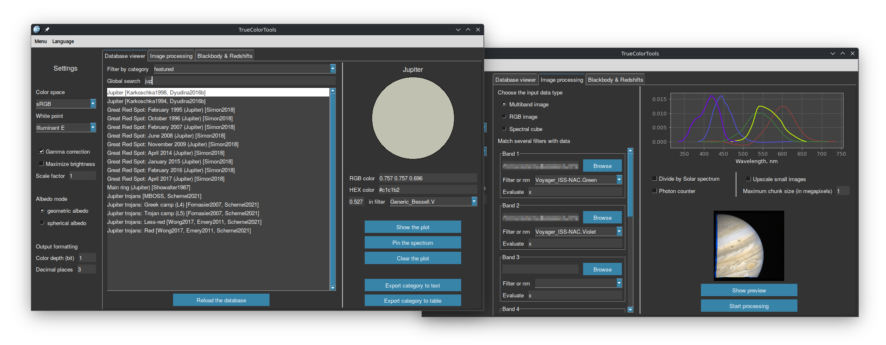

# TrueColorTools
Astronomy-focused set of Python tools with GUI that use spectra construction and eye absorption to calculate realistic colors.

Input data is accepted in the form of filters measurements (like color indices) or continuous spectra, in units of flux or in magnitudes. Customizable output in floating point or hexadecimal formats. Multiband image processing and blackbody/redshifts colors calculating are also supported.

**Note**: Image processing is temporarily unavailable. Go to commit [#13cd296](https://github.com/Askaniy/TrueColorTools/commit/13cd29639f2a7d8cc2055f8551d79720d5ee1a05) where it works (but slowly), or wait until a faster implementation is done.

## Installation

### Basic installation way

TrueColorTools has been tested on Windows 10/11, macOS and Linux. It requires Python 3.10 or higher version, which do not support Windows 7. [This](https://github.com/adang1345/PythonWin7) launch tool can be used for the case.

1. Clone the repository or download archive by the GitHub web interface (press the button `Code`, then choose `Download ZIP` and unpack the archive after downloading);
2. Ensure that you have libraries listed in [requirements.txt](requirements.txt). You can install them all at once using the following command: `python3 -m pip install -r requirements.txt`;
3. Execute `python3 -u runTCT.py`.

### In a virtual environment

2. Open the folder in terminal and create a virtual environment with `python3 -m venv .venv`;
3. Install the libraries needed by `.venv/bin/pip install -r requirements.txt` (versions were frozen as of January 2024);
4. Execute `.venv/bin/python3 -u runTCT.py`.

### Executable file

[SevenSpheres](https://github.com/SevenSpheres) compiles stable versions of TrueColorTools for Windows 8/10/11. Thus, Python is not required in this installation way.

1. Go to [releases of SevenSpheres' fork](https://github.com/SevenSpheres/TrueColorTools/releases);
2. Select, download and unpack the desired archive from the assets;
3. Run `TCT.exe`.

## How it works?

The key processing method is converting a photometry data into a continuous spectrum and convolve it with color matching functions of an eye. Summarizing the standard steps:

1. Reading data, converting to the form "wavelength: brightness value". Built-in filter information is used to work with color indices and spacecraft images.
2. The obtained values ​​are interpolated (and extrapolated if required). The program uses its own functions for this, which work faster and more reliably than from SciPy. In plans replacing interpolation with a multidimensional minimum search.
3. There are two ways to get color. The first (default) convolve spectrum with experimentally obtained sensitivity curves directly. In the sRGB mode the calculations are more complex, but generally accepted: processing a spectrum first into the XYZ space, from which it transformed into sRGB with illuminant E (the equal energy white point is much better for our purposes than the standard D65).

## How to use?
GUI is the only way to interact with TrueColorTools. When running it from the command line, you can set the startup language <!--- and CLI verbosity level--> (run with `--help` for details). No internet connection is required, the databases are stored in the appropriate folders of the repository, and you can replenish them.

Program interface is functionally divided into tabs: *Database viewer*, *Image processing* and *Blackbody & Redshifts*. Color output formatting, often common to tabs, is located in the sidebar settings.

**Database viewer** provides access to the spectra database and allows you to calculate a color with the selected settings just by clicking on an object. It is possible to plot one or several spectra from the database in a pop-up window. You can process the colors of an entire category at once, and get the output in the text form or a graphic table ([examples](tables/)).

**Image processing** accepts regular images, a series of black and white images, or a spectral cube as input. Using wavelength information, the image is restored in true colors. Internally, this works by reconstructing the spectrum for each pixel.

**Blackbody & Redshifts tab** calculates the influence of physical phenomena on color. Based on the blackbody spectrum, the program displays the changes in color and brightness from Doppler and gravitational redshifts. You can lock the exposure on the apparent magnitude logarithmic scale, adjusting the overexposure limit for a tuned blackbody object if it was in the sky replacing the Sun (with the angular size).

### Features
- Tag system: Each spectrum in the database can be assigned an arbitrary set of tags. They form lists of categories for the *Database viewer* tab, which makes working with the database easier.
- Reference system: Each object in the database can be easily linked to one or several data sources by its short name. You can see the list in `File`→`References`.
- Multilingual support: The language can be changed through the top menu in runtime. TCT supports English, German and Russian. If you want to add support for your language, you can do it by analogy in [`strings.py`](src/strings.py) and make a commit or contact me.

## Databases

### Spectra database structure
Data listed in a JSON5 file can be of two types: reference and photometry. There are no restrictions on their order and relative position at all (data block and its reference block can be in different files), but it is usually convenient to list the sources at the beginning of the file, then the spectra.

The brightness scale is not strictly tied to physical quantities. Using the `albedo` key, you can indicate that the incoming spectrum is scaled and the brightness in the range 0 to 1 should be treated as reflectance. The scaling task can be left to the program by specifying a wavelength or filter for which the albedo is known. Optional internal standard is flux spectral density measured in W / (m² nm).

For the visible range, there are two main types of albedo: geometric (or normal) and spherical one. The first albedo is for the observer between the light source and the object. It is usually brighter than the spherical, average albedo in all directions. If one of them was not specified in the database, TCT uses a theoretical model to convert one to the other for the appropriate brightness display mode. If no albedo is specified, the object will not be displayed in albedo modes (exception: if there is a tag `star`). The `albedo` parameter indicates both at once, but it is not recommended.

It is assumed that all data is indicated in ascending wavelength order, and it is necessary to specify "white spectrum" for calibration if photometric system you use not determines it by equal-energy one by wavelengths ([this link](https://hst-docs.stsci.edu/acsdhb/chapter-5-acs-data-analysis/5-1-photometry#id-5.1Photometry-5.1.15.1.1PhotometricSystems,Units,andZeropoints) may help). Typically you need to specify `calib: 'AB'` when working with Sloan filters and `'Vega'` for all other cases.

Supported input keys of a database unit:
- `nm` (list): list of wavelengths in nanometers
- `br` (list): same-size list of "brightness", flux in units of energy (not a photon counter)
- `mag` (list): same-size list of magnitudes
- `sd` (list/number): same-size list of standard deviations or a general value
- `nm_range` (dict): `start`, `stop`, `step` keys defining a wavelength range
- `slope` (dict): `start`, `stop`, `power` keys defining a spectrum from spectrophotometric gradient
- `file` (str): path to a text or FITS file, recommended placing in `spectra` or `spectra_extras` folder
- `filters` (list): list of filter names that can be found in the `filters` folder
- `indices` (list): dictionary of color indices, formatted `{'filter1-filter2': *float*, ...}`
- `system` (str): a way to bracket the name of the photometric system
- `calib` (str): `Vega` or `AB` filters zero points calibration, `ST` is assumed by default
- `albedo` (bool/list): indicates data as albedo scaled or tells how to do it with `[filter/nm, br, (sd)]`
- `geometric_albedo` (bool/list): indicator of geometric/normal albedo data or how to scale to it
- `spherical_albedo` (bool/list): indicator of spherical albedo data or how to scale to it
- `br_geometric`, `br_spherical` (list): specifying unique spectra for different albedos
- `sd_geometric`, `sd_spherical` (list/number): corresponding standard deviations or a general value
- `sun` (bool): `true` to remove Sun as emitter
- `tags` (list): strings, categorizes a spectrum

You can store the file with the spectrum outside of JSON5, and put a link in it. Text (\*.txt, \*.dat) and FITS (\*.fits, \*.fit) formats are supported for external files. A text file must at least contain wavelengths in the first column, flux in the second column, and optionally standard deviations in the third column. In FITS files data is assumed to be in the second HDU. If you have problems reading FITS, contact me, I'll improve the parsing on the provided example.

As in JSON5, the default wavelengths for external files are in nanometers and the spectrum is in energy density. For FITS files, TCT will try to determine the wavelength unit from internal data. You can also forcefully specify the data type through letters in the file extension (`.txt` for example):
- `.txtN` for nanometers, `.txtA` for ångströms, `.txtU` for micrometers;
- `.txtE` for energy counters, `.txtP` for photon counters.

### Spectra database extension
The data in the `/spectra` folder can be modified by user (except for the "vital" spectra of the [Sun](spectra/files/CALSPEC/sun_reference_stis_002.fits) and [Vega](spectra/files/CALSPEC/alpha_lyr_stis_011.fits)). The display order in the *Database viewer* is determined by the file names and the order within the file. When repeating the spectrum header in the database, the last spectrum replaces the previously specified one. Tags can be anything, nothing will break. Their list is formed after reading the files. `/spectra_extras` is recommended as a storage location for user files and add-ons; they will be shown last in the GUI. There's a [pinned issue](https://github.com/Askaniy/TrueColorTools/issues/26) for sharing "official" and users' add-ons. Pull requests are welcome too.

### Filters database extension
TCT use filter sensitivity profiles for accurate spectrum restoration. They are provided by [SVO Filter Profile Service](http://svo2.cab.inta-csic.es/svo/theory/fps3/index.php) and stored [here](/filters). To replenish the database, select a filter on the site, choose the "ascii" data file and place it in the folder. You need also specify the wavelength unit (usually ångströms, so you get the `.datA` extension). If you see "Detector Type: **P**hoton counter" in the filter description there (instead of "Energy counter" we need) you need to add `P` to the extension. Please note that [V band filter](filters/Generic_Bessell.V.dat) in the `/filters` folder is "vital".

Brief help on the UBVRI photometric system implementations:
- `Generic_Johnson` takes into account the sensitivity of photomultiplier tubes, mostly affected on R and I bands. Use **only** if the measurements were actually recorded on a PMT.
- `Generic_Cousins` contains only R and I bands. Can be used with the U, B, V from Johnson system directly, but the error is expected to be large.
- `Generic_Bessell` is actually Johnson—Cousins system for CCD receiver. Recommended by default.

## Acknowledgements

This research has made use of:
- [Spanish Virtual Observatory](https://svo.cab.inta-csic.es) project funded by MCIN/AEI/10.13039/501100011033/ through grant PID2020-112949GB-I00
    - [The SVO Filter Profile Service. Rodrigo, C., Solano, E., Bayo, A., 2012](https://ui.adsabs.harvard.edu/abs/2012ivoa.rept.1015R/abstract); 
    - [The SVO Filter Profile Service. Rodrigo, C., Solano, E., 2020](https://ui.adsabs.harvard.edu/abs/2020sea..confE.182R/abstract); 
- [Colour & Vision Research laboratory and database](http://www.cvrl.org/)
    - [Stiles & Burch (1959) 10-deg individual colour matching functions](http://www.cvrl.org/database/text/sb_individual/sb10_individual.htm);
    - [CIE (2012) 10-deg XYZ “physiologically-relevant” colour matching functions](http://www.cvrl.org/database/text/cienewxyz/cie2012xyz10.htm).